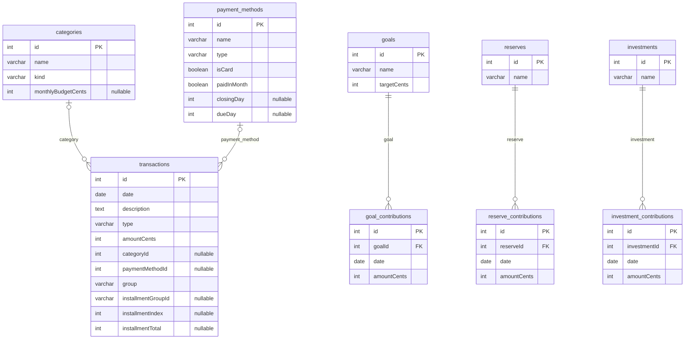

# Modelo de Dados

## Diagrama ER

## Conceitual
- Categoria classifica lancamentos e define tipo (income/expense) e orcamento mensal.
- Metodo de pagamento define o meio de pagamento e dados de cartao quando aplicavel.
- Lancamento registra entradas e saidas por data, valor e grupo (fixo/variavel/parcelado/entrada).
- Meta financeira recebe aportes que somam o valor atual.
- Reserva e um container unico de emergencia com seus aportes.
- Investimento representa contas de investimento com seus aportes.

## Logico (tabelas e campos)
- categories: id, name, kind, monthlyBudgetCents.
- payment_methods: id, name, type, isCard, paidInMonth, closingDay, dueDay.
- transactions: id, date, description, type, amountCents, categoryId, paymentMethodId, group, installmentGroupId, installmentIndex, installmentTotal.
- goals: id, name, targetCents.
- goal_contributions: id, goalId, date, amountCents.
- reserves: id, name.
- reserve_contributions: id, reserveId, date, amountCents.
- investments: id, name.
- investment_contributions: id, investmentId, date, amountCents.

## Relacoes e cardinalidade
- categories 1 -> 0..N transactions (categoryId opcional no lancamento).
- payment_methods 1 -> 0..N transactions (paymentMethodId opcional no lancamento).
- goals 1 -> 0..N goal_contributions (obrigatorio).
- reserves 1 -> 0..N reserve_contributions (obrigatorio).
- investments 1 -> 0..N investment_contributions (obrigatorio).

## Enumeracoes principais
- transactions.type: entry | exit.
- transactions.group: fixed | variable | installment | entry.
- payment_methods.type: cash | transfer | debit | credit_card | other.
- categories.kind: income | expense.
