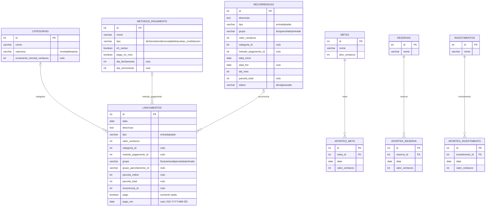

> Referencia conceitual em PT-BR (nao-runtime). Fonte canonica tecnica: `docs/canonicos/MODELO_DADOS.md` e `docs/canonicos/API_CONTRACT.md`.

```mermaid
erDiagram
  CATEGORIAS o|--o{ LANCAMENTOS : categoria
  METODOS_PAGAMENTO o|--o{ LANCAMENTOS : metodo_pagamento
  RECORRENCIAS o|--o{ LANCAMENTOS : recorrencia
  METAS ||--o{ APORTES_META : meta
  RESERVAS ||--o{ APORTES_RESERVA : reserva
  INVESTIMENTOS ||--o{ APORTES_INVESTIMENTO : investimento

  CATEGORIAS {
    int id PK
    varchar nome
    varchar natureza  "receita|despesa"
    int orcamento_mensal_centavos "nulo"
  }

  METODOS_PAGAMENTO {
    int id PK
    varchar nome
    varchar tipo  "dinheiro|transferencia|debito|cartao_credito|outro"
    boolean eh_cartao
    boolean paga_no_mes
    int dia_fechamento "nulo"
    int dia_vencimento "nulo"
  }

  RECORRENCIAS {
    int id PK
    text descricao
    varchar tipo  "entrada|saida"
    varchar grupo  "fixo|parcelado|entrada"
    int valor_centavos
    int categoria_id "nulo"
    int metodo_pagamento_id "nulo"
    date data_inicio
    date data_fim "nulo"
    int dia_mes
    int parcela_total "nulo"
    varchar status  "ativa|pausada"
  }

  LANCAMENTOS {
    int id PK
    date data
    text descricao
    varchar tipo  "entrada|saida"
    int valor_centavos
    int categoria_id "nulo"
    int metodo_pagamento_id "nulo"
    varchar grupo  "fixo|variavel|parcelado|entrada"
    varchar grupo_parcelamento_id "nulo"
    int parcela_indice "nulo"
    int parcela_total "nulo"
    int recorrencia_id "nulo"
    boolean pago "somente saida"
    date pago_em "nulo; ISO YYYY-MM-DD"
  }

  METAS {
    int id PK
    varchar nome
    int alvo_centavos
  }

  APORTES_META {
    int id PK
    int meta_id FK
    date data
    int valor_centavos
  }

  RESERVAS {
    int id PK
    varchar nome
  }

  APORTES_RESERVA {
    int id PK
    int reserva_id FK
    date data
    int valor_centavos
  }

  INVESTIMENTOS {
    int id PK
    varchar nome
  }

  APORTES_INVESTIMENTO {
    int id PK
    int investimento_id FK
    date data
    int valor_centavos
  }
```
