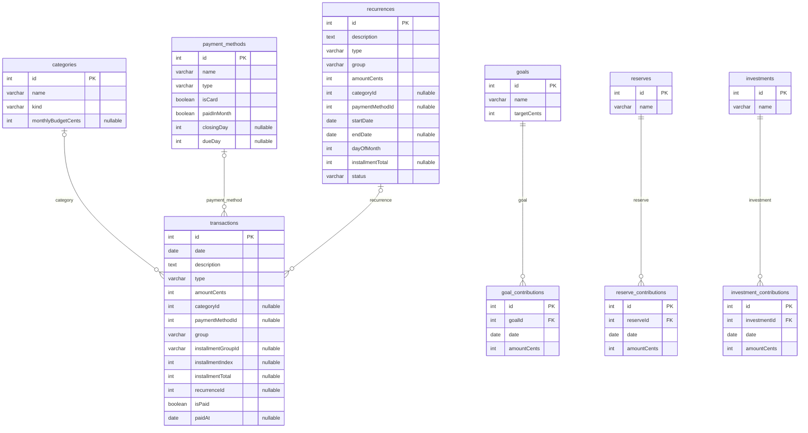

# Modelo de Dados

## Diagrama ER

## Conceitual
- Categoria classifica lancamentos, define tipo (income/expense) e orcamento mensal.
- Metodo pagamento define meio e dados cartao quando aplicavel.
- Lancamento registra entradas/saidas por data, valor e grupo (fixo/variavel/parcelado/entrada).
- Recorrencia define lancamento mensal recorrente (fixo ou parcelado), gera transacoes.
- Meta financeira recebe aportes que somam valor atual.
- Reserva: container unico emergencia + aportes.
- Investimento: conta investimento + aportes.

## Logico (tabelas e campos)
- categories: id, name, kind, monthlyBudgetCents.
- payment_methods: id, name, type, isCard, paidInMonth, closingDay, dueDay.
- transactions: id, date, description, type, amountCents, categoryId, paymentMethodId, group, installmentGroupId, installmentIndex, installmentTotal, recurrenceId.
- transactions (pagamento): isPaid (default false), paidAt (nullable).
- recurrences: id, description, type, group, amountCents, categoryId, paymentMethodId, startDate, endDate, dayOfMonth, installmentTotal, status.
- goals: id, name, targetCents.
- goal_contributions: id, goalId, date, amountCents.
- reserves: id, name.
- reserve_contributions: id, reserveId, date, amountCents.
- investments: id, name.
- investment_contributions: id, investmentId, date, amountCents.

## Relacoes e cardinalidade
- categories 1 -> 0..N transactions (categoryId opcional).
- payment_methods 1 -> 0..N transactions (paymentMethodId opcional).
- recurrences 1 -> 0..N transactions (recurrenceId opcional).
- goals 1 -> 0..N goal_contributions (obrigatorio).
- reserves 1 -> 0..N reserve_contributions (obrigatorio).
- investments 1 -> 0..N investment_contributions (obrigatorio).

## Enumeracoes principais
- transactions.type: entry | exit.
- transactions.group: fixed | variable | installment | entry.
- payment_methods.type: cash | transfer | debit | credit_card | other.
- categories.kind: income | expense.
- recurrences.type: entry | exit.
- recurrences.group: fixed | installment | entry.
- recurrences.status: active | paused.

## Regras de recorrencia (dados)
- Recorrencia = template; transacoes = fonte verdade para relatorios.
- Geracao transacoes: automatica no CRUD recorrencias (create/update), por grupo/datas/status.
- Edicoes afetam so ocorrencias futuras.
- Delete: remove template + limpa transacoes vinculadas nao pagas (preserva pagas).
- Parcelamento: group = installment, endDate e installmentTotal obrigatorios.
- Receita: type = entry e group = entry.
- dayOfMonth > ultimo dia mes usa ultimo dia mes.
- Recorrencia fixa longa usa endDate = null (ex: aluguel, internet).
- endDate nulo: geracao cobre 24 meses a partir de startDate.
- Reajuste valor: criar nova recorrencia com novo amountCents e startDate, pausar anterior (preserva historico).

## Regras de pagamento (dados)
- So `transactions.type = exit` pode ser marcado pago.
- `transactions.type = entry` exige `isPaid = false` e `paidAt = null` (backend auto-limpa se tipo alterado).

## Migracao incremental (dados)
- Manter installmentGroupId, installmentIndex, installmentTotal como legado.
- Adicionar recurrenceId opcional em transactions para novos recorrentes.
- Gerar recurrences de installmentGroupId so quando dados consistentes.
- Preencher recurrenceId em transacoes migradas sem alterar valores existentes.